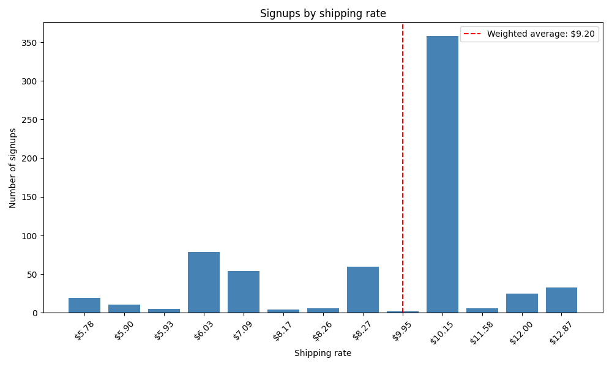

# Shopify SMS-Based Shipping Rate Estimator

## Purpose
Most clothing brands set a flat shipping rate charging a flat rate with no data behind it. This project replaces that guess with a real number: it takes a brand's SMS signup list, uses each subscriber's phone area code as a stand-in for their location, looks up live carrier shipping rates for those locations, and computes a signup-weighted average shipping cost. The result tells a seller whether their flat rate is actually well-calibrated to where their real customers live, instead of just an arbitrary number.

## Chart in Action:


## Repo layout:
```
shopify-shipping-rate/
├── data/
│   ├── area_code_reference.csv    # area_code -> representative_zip/city/region/country (built once, checked in)
│   └── raw/                        # gitignored, one-time source dataset used to build the table above
├── src/
│   ├── load.py                     # CSV loading + phone number normalization
│   ├── area_codes.py               # extract area code from phone number + reference table lookup
│   ├── build_area_code_reference.py  # one-time script that builds data/area_code_reference.csv
│   ├── rates.py                    # EasyPost API client + per-area-code rate lookup
│   ├── metrics.py                  # weighted average, spread (std dev/min/max), rate distribution
│   └── chart.py                    # matplotlib bar chart of the rate distribution
├── main.py                         # runs the full pipeline end to end
├── requirements.txt
├── .env.example
├── CLAUDE.md                       # project working notes / decisions log
├── PROJECT_NOTES.md                # methodology, assumptions, metric definitions
└── README.md
```

## Tech Stack / Libraries
Python, [pandas](https://pandas.pydata.org/) (CSV handling + aggregation), [EasyPost](https://www.easypost.com/) (live USPS rate lookups via REST API), [requests](https://requests.readthedocs.io/) (HTTP calls), [python-dotenv](https://github.com/theskumar/python-dotenv) (API key management), [matplotlib](https://matplotlib.org/) (visualization).

## Technicals
The pipeline starts with a raw SMS signup export (`created_at, customer_id, email, full_name, keyword, phone_number`), of which only `phone_number` is used. Since the export has no address or ZIP for subscribers, the phone number's area code (the 3 digits after the leading NANP country code `1`) is used as a location proxy.

USPS pricing needs an actual ZIP code, not an area code, so the next step maps each area code to one representative ZIP via a static reference table (`data/area_code_reference.csv`). This table was built once from a public NANP dataset covering every US/Canada area code.

For rates, the pipeline uses [EasyPost](https://www.easypost.com/) to map each area code's representative ZIP to a real shipping rate. For each *unique* area code present in a signup list, the representative ZIP (plus a fixed origin ZIP and package weight/dimensions) is sent to EasyPost, and the response is filtered down to USPS's Ground Advantage service, the standard low-cost tier used for typical e-commerce packages. USPS was chosen specifically because it's generally the cheapest and fastest option for packages like this. The analysis is scoped to domestic (US) shipping only. 

Every rate lookup is cached to `data/rate_cache.json`, keyed by area code. Before making a call, the pipeline checks whether that area code has already been looked up, whether from this run or any *previous* run, on this list or a different one. This means running the pipeline on a new, bigger, or repeated signup list only ever calls the API for area codes that have genuinely never been seen before, instead of re-fetching everything from scratch each time.

Once every area code in a list has a cached rate, the core number is a **signup-weighted average**:
```
weighted average = (count_1 * rate_1 + count_2 * rate_2 + ... + count_n * rate_n) / total signups
```
where every unique area code present in the list automatically becomes its own group, with no manual "is this region big enough to matter" logic. A handful of subscribers in a rare area code just contributes a small term to the sum, so a large nearby cluster naturally dominates a few distant outliers, exactly as it should.

On top of the average, the pipeline also computes:
- **Rate distribution**: how many signups land at each distinct price, and which single area code contributes the most signups to each one
- **Weighted standard deviation, min, and max**: whether the average actually represents most customers, or is masking a wide spread. The standard deviation is calculated the same way as an ordinary standard deviation would be if every individual subscriber's rate were listed out one at a time, rather than grouped by area code. Weighting by signup count is mathematically equivalent to that expansion, just computed without needing to build the full expanded list.
- A **matplotlib bar chart** of signups per rate, with the weighted average marked, a shaded ±1 standard deviation band, and the dominant area code labeled above each bar

## Results & Findings
The model was validated against three real, independently-sized SMS signup lists from the same brand (179, 440, and 723 subscribers, 1,342 total). The domestic-only weighted average held consistently in a tight **$8.96 to $9.20** range across all three, despite the lists growing by 4x, which is strong evidence this isn't a fluke of one small sample. That range sits very close to the existing $8.99 guess, and notably above the $6.99 rate that had been under consideration for the next drop, suggesting the $8.99 flat rate was already well-calibrated, and switching to $6.99 would likely have meant undercharging relative to real shipping costs.

The rate distribution also revealed something a single average number hides: in the 723-person list, over half of all domestic signups (358 of 662) landed on the exact same $10.15 rate, driven by a large cluster of customers in one region (area code 470, Atlanta). The weighted standard deviation across that list was $1.94, a moderate, not extreme, amount of spread, meaning the average is a reasonably fair single number to represent the customer base, though it doesn't reflect every individual customer's real cost.

## Problems Encountered
1. Pandas silently dropped leading zeros from ZIP codes (e.g. `06511` became `6511`) because it auto-detected the column as numeric rather than text. Fixed by explicitly forcing `dtype=str` on every ID/label-like column (phone numbers, ZIP codes), never letting pandas guess a type for something that isn't meant to be used in math.
2. The area code reference data came from a dataset last updated in 2018, so it was missing several newer area codes that didn't exist yet when it was built. This caused lookups to fail on some real signups. The fix was to look up each missing area code myself and add it to the table, matching it to the same city and region as the older area code it was created from.

## Known Limitations
- **This is a US-only analysis.** The large majority of this brand's SMS list is US-based; Canadian signups (roughly 9–14% of each list tested) are deliberately excluded rather than analyzed, since USPS's Canada-bound service has a meaningfully different cost structure. A blended average is a valid future metric, but isn't part of the current output.
- **Area code is a location proxy, not a real address.** Mobile number portability means people sometimes keep their area code after moving. This is treated as an acceptable limitation at drop-list scale, not a fatal flaw, but it's stated plainly here rather than hidden.
- **SMS subscribers may not perfectly represent actual buyers.** Some buyers won't be on the SMS list at all; if non-subscriber buyers skew toward different, pricier regions, the flat rate could run low in practice.
- **One representative ZIP stands in for an entire area code.** The reference table intentionally uses one "good enough" ZIP per area code rather than every real ZIP in that region, since USPS pricing is zone/distance-based and ZIPs sharing an area code are usually geographically close. It's an approximation, not each customer's literal address.
- **Package weight and dimensions are estimates** (2 lbs, 14.5 x 16 x 2 in for a hoodie shipment), not measured from an actual packed and weighed unit.
- **No post-drop validation yet.** The strongest possible validation, comparing this model's predicted distribution against real Shopify order addresses after an actual drop ships, hasn't been done. That comparison is the natural next step to turn "a data-driven estimate" into "a validated one."

## Installation

### Prerequisites
- Python 3 + pip
- An [EasyPost](https://www.easypost.com/) account (free test API key, no approval wait)

### 1. Clone the repo
```bash
git clone https://github.com/ansonclin/Shopify-SMS-Based-Shipping-Rate-Estimator.git
cd Shopify-SMS-Based-Shipping-Rate-Estimator
```

### 2. Install dependencies
```bash
pip install -r requirements.txt
```

### 3. Set up your EasyPost API key
Create a `.env` file in the project root (use `.env.example` as a template):
```
EASYPOST_API_KEY=your_easypost_test_key
```

### 4. Add your signup list
Place your SMS signup export CSV (with a `phone_number` column) in the project root, then point `main.py` at it:
```python
df = load_signups("your_signup_list.csv")
```

### 5. Run the pipeline
```bash
python3 main.py
```
This prints the signup-weighted average, the rate distribution, spread (std dev/min/max), and saves a chart to `rate_distribution.png`.

**Note:** `data/area_code_reference.csv` is already built and checked into the repo, so you don't need to run `src/build_area_code_reference.py` unless you want to rebuild it from fresher source data.
